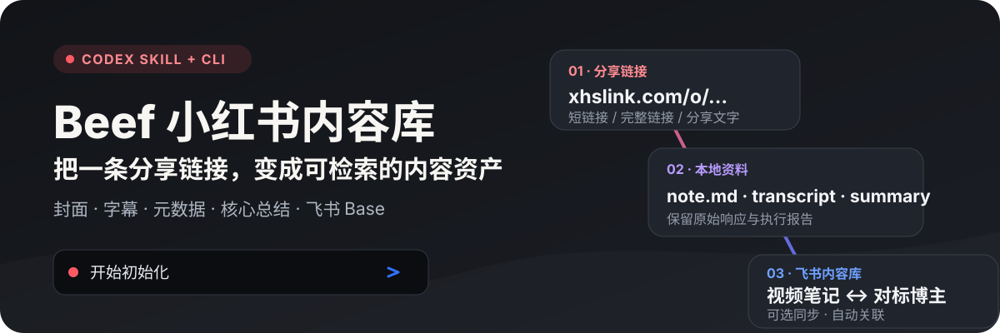
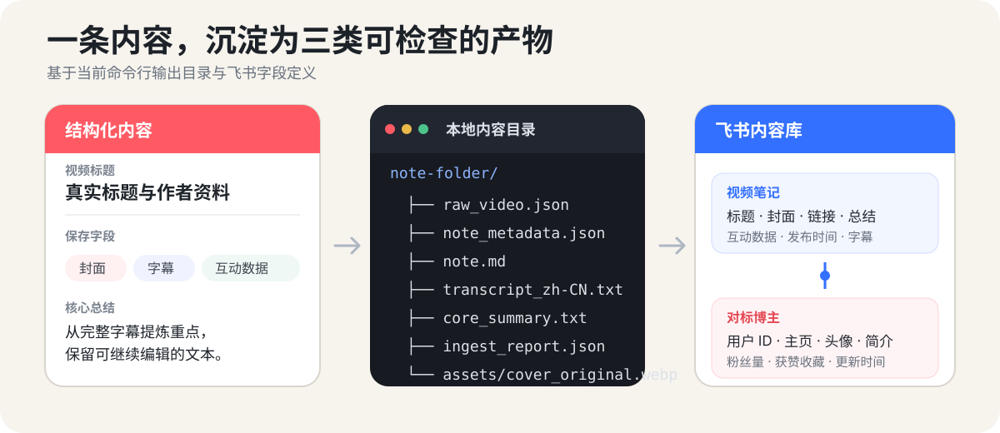
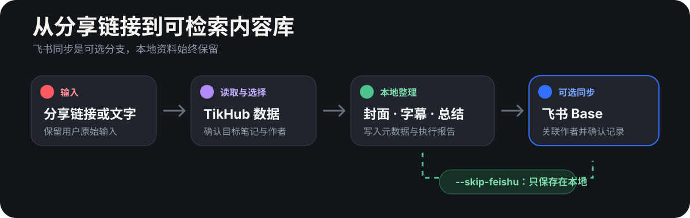

<p align="center">
  
</p>

<p align="center">
  <a href="https://beefapi.com/">
    
  </a>
</p>

把一条小红书短链接、完整链接或分享文字，整理成结构化本地资料，并可选同步到飞书多维表格。项目同时提供 **Codex Skill** 和 **独立命令行工具**，两种入口共用同一套配置、字段和处理流程。

## 一条链接，会沉淀成什么

<p align="center">
  
</p>

- 保存标题、作者、简介、发布时间、视频时长和互动数据。
- 下载原始 WebP 封面，保存字幕文本和不超过 300 字的核心总结草稿。
- 保留原始响应、结构化元数据、Markdown 笔记和执行报告，方便复核。
- 可选创建或复用飞书 Base、视频表、作者表、字段、关联和视图。
- 按小红书用户 ID 复用作者，按链接或笔记 ID 避免重复创建视频记录。

默认不会下载或上传视频文件，只保存可以打开的原始分享链接。

## 选择你的使用方式

### 路线 A：在 Codex 中使用

先把仓库安装为 Skill。可以直接对 Codex 说：

```text
帮我安装这个 skill：
https://github.com/glanderness/xhs-library
```

安装完成后，说：

```text
开始初始化
```

初始化时只需要参与两个步骤：

1. 完成飞书本地 CLI 登录。
2. 注册 TikHub、创建 API Key，并在本地隐藏输入框中填入。

其余配置、Base、表格、字段和视图会自动创建或复用。初始化完成后，可以继续说：

```text
用 xhs-library 采集这条小红书链接并同步到我的飞书 Base。
```

TikHub 注册入口：<https://user.tikhub.io/register?ref=bW0RSDaJ>

### 路线 B：使用命令行

```bash
git clone https://github.com/glanderness/xhs-library.git
cd xhs-library
./xhs-library onboard
```

初始化完成后，处理第一条分享内容：

```bash
./xhs-library run "<小红书链接或分享文字>"
```

需要 Python 3.9 或更高版本。系统缺少 `lark-cli` 时，`onboard` 会在 npm 可用的情况下自动安装。

只保存本地文件、不写入飞书：

```bash
./xhs-library run "<小红书链接或分享文字>" --skip-feishu
```

默认本地内容库目录为 `~/xhs-library`。

## 工作原理

<p align="center">
  
</p>

项目会保留原始输入和原始响应，从中选择目标笔记，整理封面、字幕、元数据与总结。启用飞书同步时，会先匹配作者记录，再创建或更新视频记录，上传封面，最后读取记录确认字段完整。

## 关键设计

- **一个入口完成准备**：`onboard` 负责本地配置、TikHub 验证、飞书登录和 Base 初始化。
- **本地资料始终保留**：即使不使用飞书，也能得到独立、可检查的内容目录。
- **作者与视频分表管理**：视频表通过关联字段连接作者表，适合长期积累对标资料。
- **避免错误合并**：优先使用作者 ID、原始链接和笔记 ID，不会只根据同名标题更新记录。
- **兼容旧入口**：保留 `./xhs-ingest`、旧环境变量和旧配置目录的迁移支持。

## 常用命令

```bash
./xhs-library onboard              # 完整初始化
./xhs-library init                 # 只创建本地配置
./xhs-library doctor               # 检查配置和依赖
./xhs-library setup-feishu         # 创建或补齐飞书数据结构
./xhs-library setup-feishu --check # 只检查现有数据结构
./xhs-library run "<分享内容>"      # 处理一条内容
```

旧入口仍然可用：

```bash
./xhs-ingest "<小红书链接>"
python3 scripts/ingest_xhs_note.py "<小红书链接>" --skip-feishu
```

## 详细文档

- [配置与环境变量](docs/configuration.md)
- [命令行完整说明](docs/cli-reference.md)
- [本地输出与飞书数据结构](docs/data-model.md)
- [常见问题](docs/troubleshooting.md)
- [Codex Skill 执行规则](SKILL.md)

## 使用范围

请只处理你有权访问和保存的内容，并遵守 TikHub、小红书和飞书各自的服务规则。项目不会替你判断内容授权范围；公开分享、再次发布或商业使用前，请自行确认相关要求。

## 作者与交流

如果你对这个 Skill、AI 自媒体或内容库工作流感兴趣，可以通过企业微信交流。

<p align="center">
  
</p>

## License

[MIT License](LICENSE)
